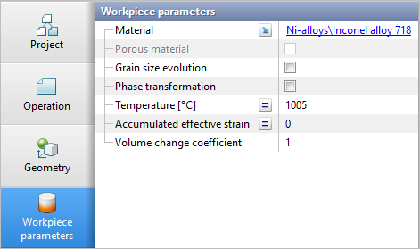

# ⛓️ Цепочка операций раскатки колец

Некоторые технологии содержат несколько операций раскатки колец с промежуточным подогревом. Такой подход применяется при раскатке колец из трудно деформируемых материалов с узким ковочным температурным интервалом.  
Наши рекомендации по созданию цепочки операций раскатки колец:

* для создания новой операции используйте кнопку  **Копировать данные из предыдущей операции** с активированной опцией **Наследовать результаты расчета**

* во вкладке **Параметры заготовки** выберите опцию - **Задается в этой операции** в строке Температура \(для имитации операции нагрева\)

* затем, задайте начальную температуру заготовки

* то же самое лучше сделать и с полем **Накопленная степень деформации** - выберите **Задается в этой операции**

* затем, задайте значение **Накопленной степени деформации** равной нулю \(для имитации процесса разупрочнения в ходе нагрева\)  

  

  

* вне остальные параметры необходимо задать согласно технологии
