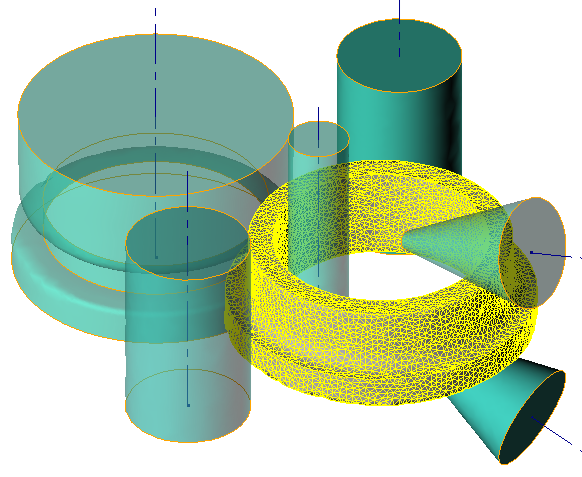
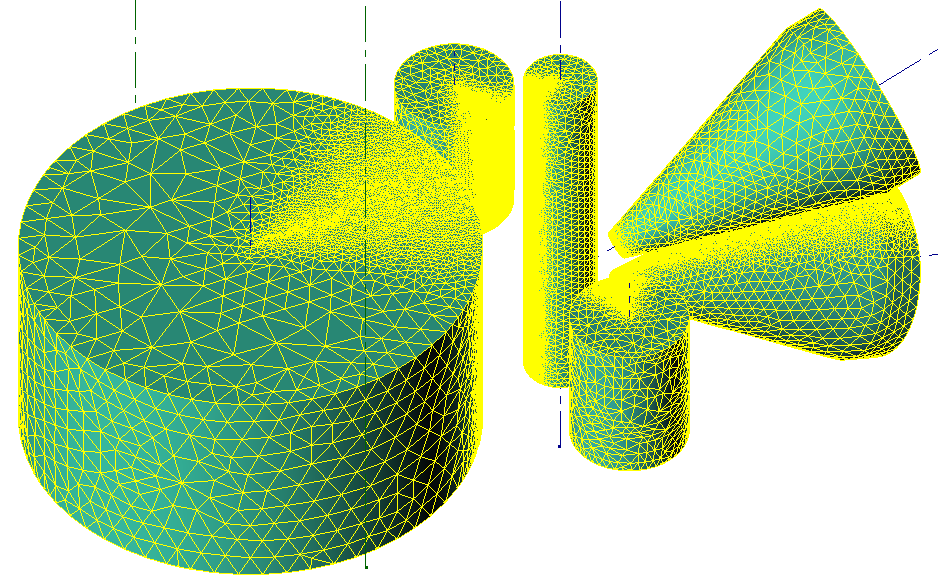

# 🚀 Особенности моделирования

## Метод двойной сетки
Метод двойной сетки используется для моделирования раскатки колец:
* на основе расчетной сетки система уравнения пластического течения металла.
* геометрическая сетка хранит термомеханические поля и форму кольца.

Этот метод используется для снижения времени расчета и повышения его точности.   

## Сетка в инструменте
Инструменты не вращаются во время расчета, потому что инструменты осесимметричные. Сетка в инструментах измельчена в области контакта с кольцом. Этот подход представляет хороший баланс между точностью и скоростью расчета. Поле скорости движется через неподвижную сетку и передает скорости кольцу, как будто сетка в инструменте физически вращается.  
