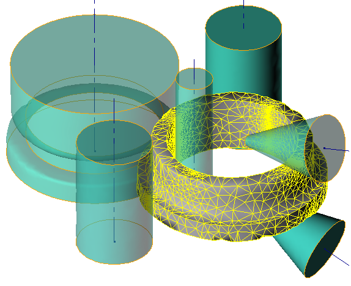

# 🚀 Features of the simulation

## Dual mesh method

Dual mesh method is used in the ring rolling module:

* on the base of the **computational mesh** the system of equations of plastic flow is calculated.
* the **geometrical mesh** contains thermo-mechanical fields and geometry of the deformed ring.

## Mesh in tools

The tools do not rotate during simulation because they are axisymmetric. The FE mesh in the tools has got the local densification in the contact area with the ring. This approach provides a good balance between accuracy and speed of simulation. The velocity field moves through the motionless mesh and transmits the velocity to the ring.

