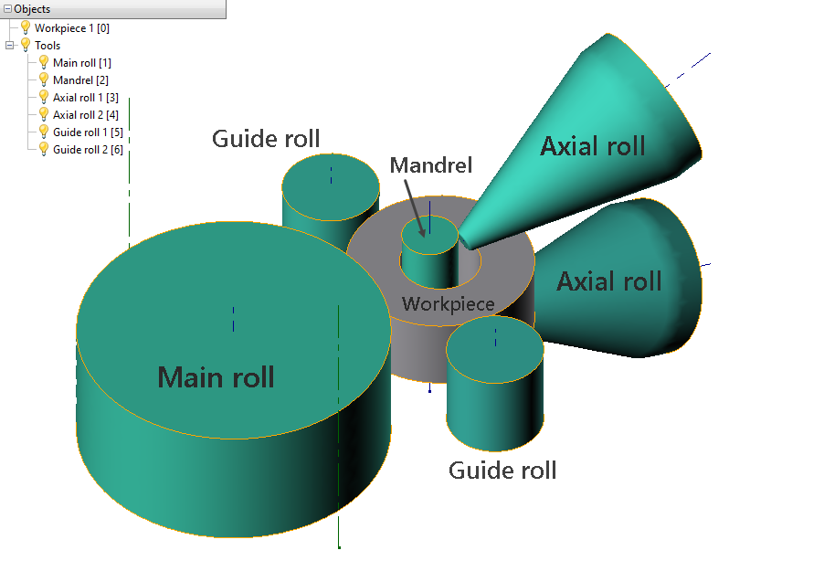

# 🔲 Подготовка геометрии

На рисунке ниже изображены инструменты, необходимые для моделирования раскатки колец: главный валок, оправка, центрирующие валки, аксиальные валки.


Без главного вала, заготовки и оправки моделирование не начнется.


