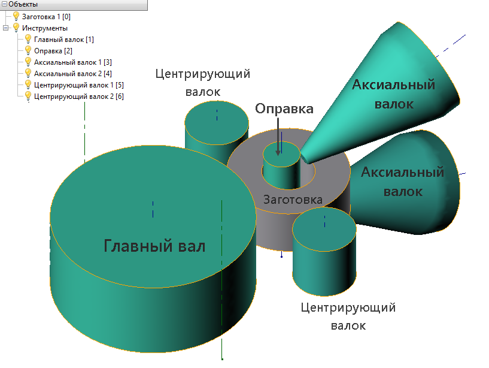

# 🔲 Geometry preparation

A set of basic tools needed to simulate the ring rolling is shown in the figure below: main roll, mandrel, guide rolls, axial rolls.


Without Main roll, workpiece and mandrel the simulation will not start


