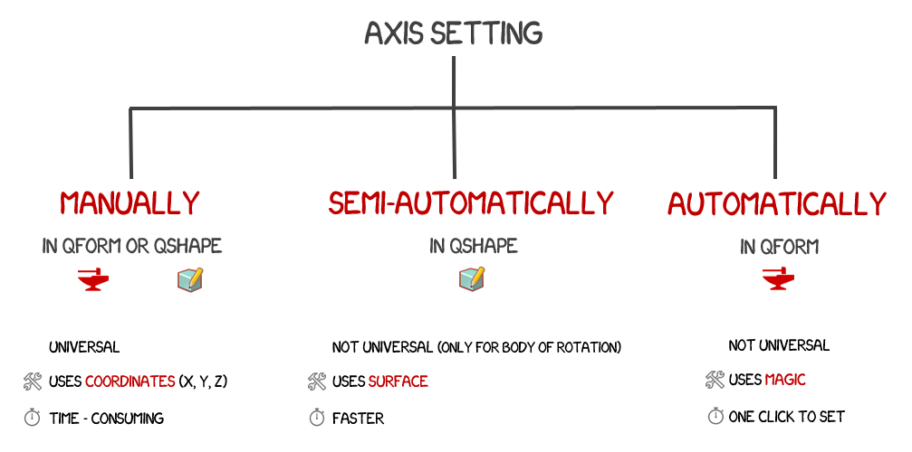
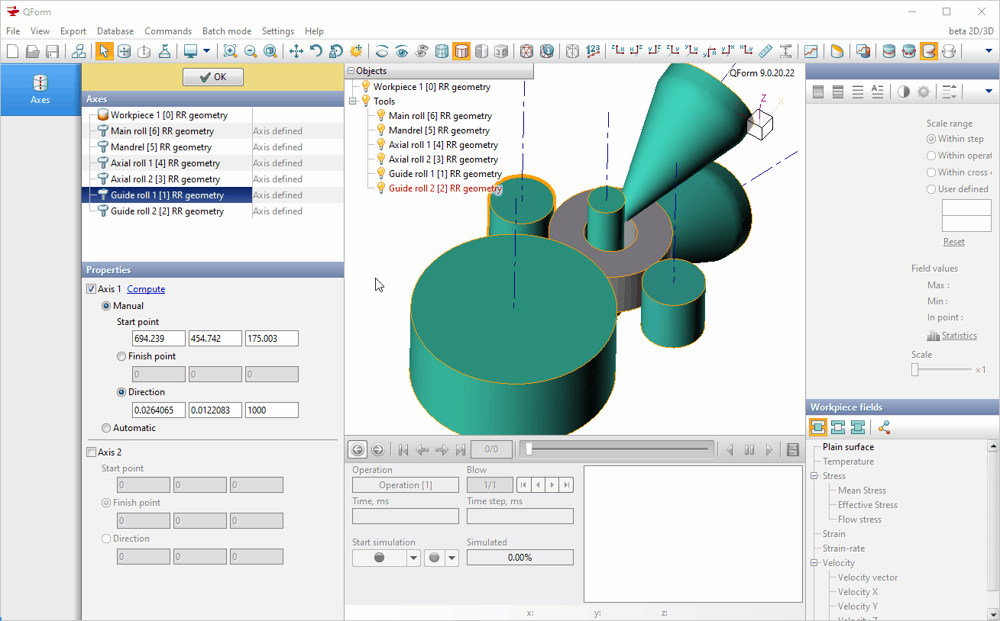

# 🪐 Задание осей

## Эволюция задания осей в QForm

## Автоматически

1. Загрузите 3D геометрию из step формата напрямую в QForm.
2. Перейдите во вкладку Оси.
3. Выделите все объекты \(использую клавишу Shift\)и нажмите на кнопку Вычислить все оси.  

## **Полуавтоматически**

Имеется возможность создания осей в полуавтоматическом режиме в редакторе 3D геометрии QShape. Геометрия должна содержать все объекты для моделирования. Используйте [STEP](https://en.wikipedia.org/wiki/ISO_10303-21?oldformat=true) формат для загрузки геометрии в  QShape.

1. Выберите Shell объект в окне Модель 
2. Нажмите на кнопку Генерация сетки в окне Операции
3. Выделите цилиндрическую или коническую поверхность на создавшемся Solid объекте\(или другую, более сложную поверхность вращения\) и нажмите на кнопку Use face axis as Axis 1
4. ПреобразуйтеSolid объект в инструмент из списка Ring rolling object

## **Вручную**

[Вторые оси](https://danila-master.gitbook.io/documentation-ring-rolling/v/v-9.1-rus/geometry-preparation/geometry-requirements) для центрирующих валков необходимо задавать в ручном режиме. Координаты вторых осей зависят от конструкции конкретных раскатных станов. Для того, чтобы вручную задать оси необходимо:

1. Перейти во вкладку Оси
2. Выбрать один из центрирующих валков
3. Поставить галочку напротив опции Ось 2  
4. Задать координаты Начальной точки \(это должна быть координата любой точки на оси\)
5. Выбрать радио кнопку Направление и задать направление Z и длину оси \(это может быть любое число, например 600 или 1000\)

