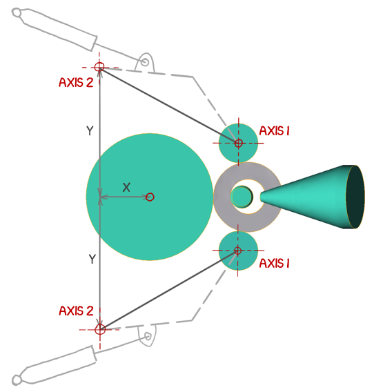

# ❗ Требования к геометрии

* Все инструменты должны иметь оси вращения
* Центрирующие валки должны иметь 2 оси вращения:
* собственную ось вращения
* и ось вращения для первой оси


Порядок осей важен


* Оси главного вала, оправки, и центрирующих валков должны быть параллельны оси Z
* Ось главного вала должна пересекать центр координат \( $$x = 0, y=0$$\)
* Не надо задавать ось для кольца, поскольку оно вращается от трения, при взаимодействии с другими инструментами.

