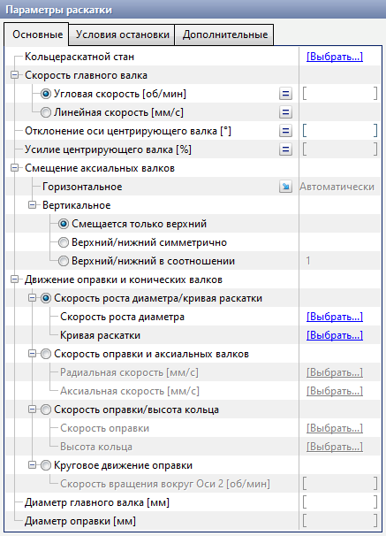
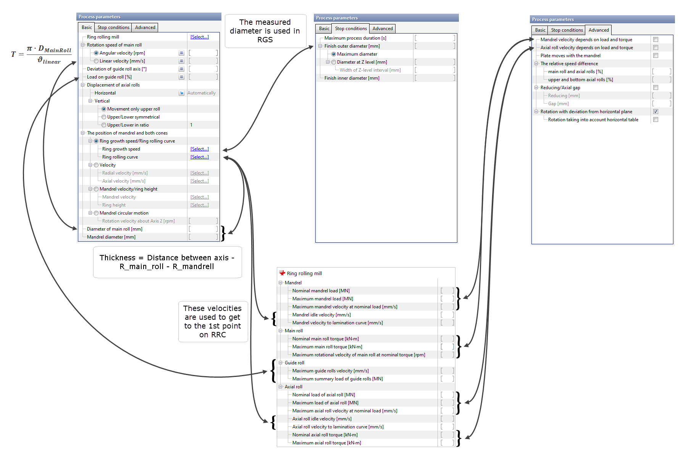

# Process parameters















Process parameters for ring rolling are divided on 3 tabs: _Basic_, _Stop conditions_, _Advanced_.

**Basic** — without these data simulation will not start.

**Stop conditions** — without these data simulation will not finish.

**Advanced** — for more accurate setting of the process.

Schema below describe the interaction between initial data.

