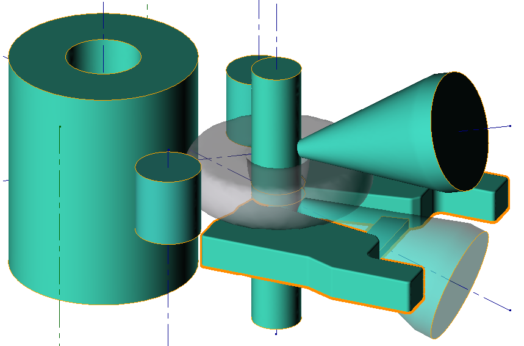

# Advanced

## Velocity depends on load and torque

**Mandrel velocity depends on load and torque \(on main roll\)** - activation of this feature allows to control the mandrel motion due to load on mandrel and torque on the main roll.

To use this feature it is necessary to set the next parameters in ring rolling mill:

* _Nominal mandrel load \[MN\]_
* _Maximum mandrel load \[MN\]_
* _Maximum mandrel velocity at nominal load \[mm/s\]_
* _Nominal main roll torque \[kN\m\]_
* _Maximum main roll torque \[kN\m\]_ 
* _Maximum rotational velocity of main roll at nominal torque \[rpm\]_

**Axial roll velocity depends on load and torque** - activation of this feature allows to control the vertical motion of axial roll due to load and torque on the axial roll.

To use this feature it is necessary to set the next parameters in ring rolling mill:

* _Nominal load of axial roll \[MN\]_
* _Maximum load of axial roll \[MN\]_
* _Maximum axial roll velocity at nominal load \[mm/s\]_
* _Nominal axial roll torque \[kN\m\]_ 
* _Maximum axial roll torque \[kN\m\]_

## Plate moves with mandrel

If this feature is activated the plate will move together with mandrel: the same direction, the same velocity

## The relative speed difference

### Main roll and axial rolls

By default, the program calculates the rotational speed of axial rolls to exclude the slipping and pushing between axial rolls and ring, i.e. linear velocities on contact are equivalent and there is no deviation of the ring relative central rolling line. Linear \(tangential\) velocity of the ring rotation corresponds to the linear \(tangential\) velocity on the main roll rotation.

By using this option it is possible to control the relative speed difference between main roll and axial rolls in contact with ring.

To describe the relative speed difference between main roll and axial rolls is used right coordinate system \([right hand rule](https://en.wikipedia.org/wiki/Right-hand_rule?oldformat=true)\). It means that to increase the relative speed of axial rolls it is necessary to set the value below zero. For instance, -10% \(top view on geometry\):

### 

### Upper and bottom axial rolls

It is possible to set the relative speed difference \(speed of rotation\) between upper and bottom axial rolls. To increase the relative speed of the upper axial roll it is necessary to set the value above zero.

For instance: value +10% means that rotational speed of upper axial roll will be on 10% greater than on the bottom axial roll \(cross cut of the ring in the axial gap\):

## Reducing/Axial gap

To describe the last stage of the ring rolling it is possible to use _Reducing/Axial gap_ option. Axial roll will move up on the _Gap_ value until the some distance to the final position \(_Reducing_\) of the mandrel.

## Rotation with deviation from horizontal plane

By default, this option is activated. We recommend do not deactivate this option for more relevant results. Also, the gravity force is taken into account by default.

Deactivation of this option add some invisible boundary condition which will hold ring from vertical displacement \(ring can't climb with this additional stabilization\).

### Rotation taking into account horizontal table

Activation of this option will add invisible boundary condition on ring.

To use this option it is necessary to specify:

* Z level of table surface. QForm uses a coordinate system like in CAD system: Z coordinates in QForm the same as in the CAD system.
* lubricant. Friction between ring and table poorly studied, so we recommend to use lubricant _Without friction_ from standard database.

Also, you could use Table like a real object \(Plate in QForm interface\) for the more accurate calculation. The table should contain two halves with the web between them. Web should be in the bottom part of the table to exclude the intersection with ring. Intersection with bottom axial roll does not have an affect on simulation.

