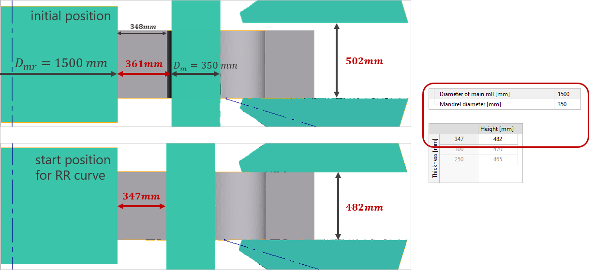

# Основные

## Кольцераскатной стан


Для учета силовых характеристик кольцераскатного стана необходимо активировать соответствующую [опцию](https://danila-master.gitbook.io/documentation-ring-rolling/v/v-9.1-rus/process-parameters/advanced#velocity-depends-on-load-and-torque).

### Оправка
Номинальное усилие оправки \[МН\] — максимальная скорость оправки начинает уменьшаться при достижении номинальной силы.
Максимальное усилие оправки \[МН\] — сила на оправке не может быть больше этого значения.
Максимальная скорость оправки при номинальном усилии \[мм/с\] — скорость оправки не может быть больше этого значения.
Скорость холостого хода оправки \[мм/с\] —скорость оправки до контакта с кольцом.
Скорость выхода оправки на кривую раскатки \[мм/с\] — скорость движения оправки \(в контакте с кольцом\) до достижения начальной точки на кривой раскатки.
### Главный вал
Номинальный крутящий момент главного вала \[кН/м\] — максимальная скорость оправки начинает уменьшаться при достижении этого значения.
Максимальный крутящий момент главного вала \[кН/м\] — момент на главном валу не может быть больше этого значения.
Максимальная скорость вращения главного вала при номинальном крутящем моменте\[об/мин\] — скорость вращения главного вала не может быть больше этого значения.
### Центрирующий валок
Максимальная скорость центрирующих валков \[мм/с\] — скорость центрирующих валков не может быть больше этого значения.
Максимальное суммарное усилие центрирующих валков \[МН\] — сила на двух центрирующих валках не может быть больше этого значения.
### Аксиальный валок
Номинальное усилие аксиального валка \[МН\] — максимальная скорость движения аксиального вала снижается при достижении заданного значения.
Максимальное усилие аксиального валка \[МН\] — сила на аксиальном валке не может быть больше этого значения.
Максимальная скорость аксиального валка при номинальном усилии \[мм/с\] — скорость вращения аксиального валка не может быть больше этого значения.
Скорость холостого хода аксиального валка \[мм/с\] — скорость аксиального валка до контакта с кольцом.
Скорость выхода аксиального валка на кривую раскатки \[мм/с\] — скорость аксиального валка \(в контакте с кольцом\) до достижения начальной точки на кривой раскатки.
Номинальный крутящий момент аксиального валка \[кН\м\] — максимальная скорость движения аксиального вала снижается при достижении заданного значения.
Максимальный крутящий момент аксиального валка \[кН\м\] — момент на аксиальном валке не может быть больше этого значения.
## Скорость главного вала

Необходимо выбрать один из двух вариантов задания вращения главного вала: угловая скорость или линейная скорость.
Для обоих вариантов можно задать, либо постоянную скорость вращения, либо переменную, зависящую от внешнего диаметра кольца.
## Центрирующие валки

### Усилие центрирующего валка
Сила на центрирующих валков задается в процентах от Максимального суммарного усилия центрирующих валков \(База данных кольцераскатных станов\). Сила на центрирующих валках может быть задана как постоянно значение, либо как табличная функция в зависимости от текущего внешнего диаметра.
Центрирующие валки оказывают большое влияние на стабильность процесса раскатки колец и соответственно на результат моделирования. Поэтому, используйте центрирующие валки в моделировании, если они у вас используются в реальном техпроцессе.
### Отклонение оси центрирующего валка
Для описания отклонения центрирующих валков от центральной оси раскатки используется правая система координат \([правило правой руки](https://ru.wikipedia.org/wiki/%D0%9F%D1%80%D0%B0%D0%B2%D0%B8%D0%BB%D0%BE_%D0%B1%D1%83%D1%80%D0%B0%D0%B2%D1%87%D0%B8%D0%BA%D0%B0?oldformat=true)\).

На практике, эта опция используется вместе с  [относительная скорость движения главного вала и аксиальных валков](advanced.md#main-roll-and-axial-rolls).
## Смещение аксиальных валков
### Горизонтальное
Имеется 3 варианта задания горизонтального движения аксиальных валков:
* Автоматически \(по умолчанию\). Горизонтальная скорость движения аксиальных валков равна половине скорости роста кольца.
* Таблица. Горизонтальная скорость движения аксиальных валков зависит от текущего внешнего диаметра кольца.
* Начиная с заданного диаметра. Аксиальные валки начинают движение после достижения заданного внешнего диаметра кольца.  Скорость движения аксиальных валков равна скорости роста кольца.
### Вертикальное
* Смещается только верхний. Смещается только верхний аксиальный валок. 
* Верхний/Нижний симметрично. Верхний и нижний аксиальные валки движутся навстречу друг другу или удаляются друг от друга с одинаковой скоростью. 
* Верхний/Нижний в соотношении. Верхний и нижний аксиальные валки движутся навстречу друг другу или удаляются друг от друга с заданным соотношением скоростей.
## Движение оправки и конических валков
Имеется несколько вариантов задания движения оправки и аксиальных валков:
* Скорость роста диаметра / Кривая раскатки
* Скорость оправки и аксиальных валков
* Скорость оправки / Высота кольца
* Круговое движение оправки
Выберите один из вариантов задания кинематики движения инструментов в зависимости от используемого типа кольцераскатного стана:

### Скорость роста диаметра / Кривая раскатки

По умолчанию, используется адаптивный алгоритм: вычисление скорости оправки и аксиальных валков основывается на текущем внешнем диаметре кольца.
Необходимо задать две таблицы:
Кривая раскатки — высота кольца зависит от его толщины.

Скорость роста кольца — скорость роста кольца зависит от текущего внешнего диаметра кольца.

Необходимо знать текущую толщину, высоту и диаметр кольца, чтобы на основании этих двух графиков находить скорость движения инструментов:
* вычисление толщины кольца зависит от расстояния между осями главного вала и оправки \(X\), радиуса главного вала и радиуса оправки
$$
\text {Толщина}=X-R_{\text {главный вал}} -R_{\text {оправка}}
$$
* высота кольца вычисляется автоматически в зависимости от взаимного расположения аксиальных валков
* внешний диаметр кольца может вычисляться как максимальный диаметр или как диаметр на каком то заданном уровне по Z; в зависимости от того, что задано во вкладке Условия остановки:  максимальный диаметрили диаметр по уровню Z.
#### Выход на кривую раскатки
Скорость движения оправки и аксиальных валков до достижения начальной точки на кривой раскатки определяется следующими параметрами из базы данных кольцераскатных станов:
* Скорость холостого хода оправки
* Скорость выхода оправки на кривую раскатки
* Скорость холостого хода аксиального валка
* Скорость выхода аксиального валка на кривую раскатки

### Скорость оправки и аксиальных валков
Радиальная скорость — скорость движения оправки в зависимости от времени.

Аксиальная скорость — скорость уменьшения расстояния между аксиальными валками.

### Скорость оправки/ высота кольца
Необходимо задать две таблицы:
Скорость оправки — скорость оправки зависит от текущего внешнего диаметра кольца.

Высота кольца — высота кольца зависит от текущего внешнего диаметра кольца.

### Круговое движение оправки
Вы можете увидеть объяснение этого типа движения инструментов на схеме ниже.
Источник: ASM Handbook Vol. 14 - Forming and Forging

Схематически показан принцип работы четырех-позиционного кольцераскатного стана. Кольцевая заготовка загружается в позиции 1. Раскатка кольца начинается в позиции 2 и завершается в позиции 3. Конечное кольцо извлекается на позиции 4. A, главный вал; B, оправки; C, центрирующие валки.
Необходимо задать вторую для оправки для этого типа оборудования. Красная точка на картинке выше показывает расположение второй оси оправки.
Необходимо задать один параметр для этого типа движения оправки:
Скорость вращения вокруг Оси 2 \[об/мин\] — скорость вращения оправки вокруг второй оси.
## Диаметр главного вала
Необходимо задать диаметр оправки.
Диаметр главного вала необходим для:
* определения скорости вращения главного вала при использовании Линейной скорости
* нахождения текущей толщины кольца
> текущая толщина кольца используется для определения скорости оправки и аксиальных валков \(если используется кривая раскатки и скорость роста кольца\)
## Диаметр оправки
Необходимо задать диаметр оправки.
Диаметр оправки используется для нахождения текущей толщины кольца.
