# 🌍 Basic

## Ring rolling mill

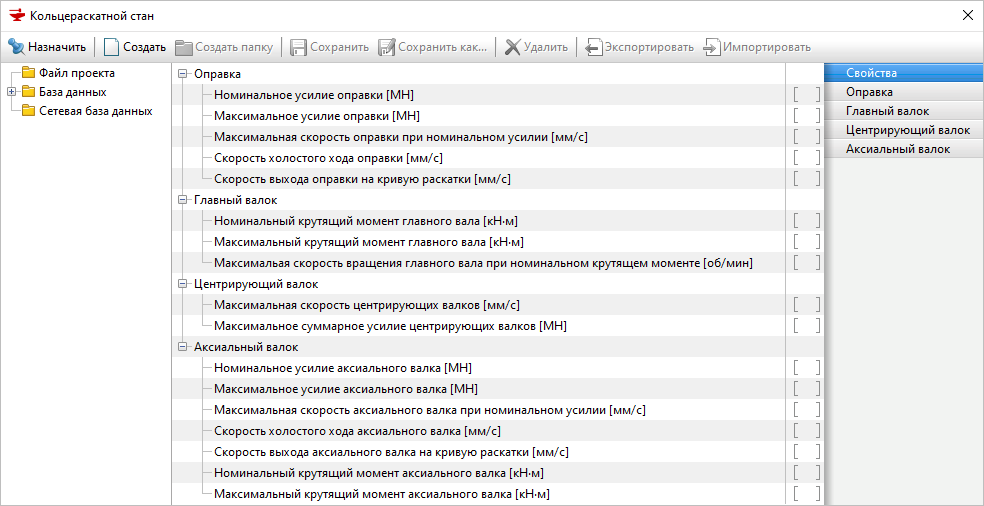

\_\_

\_\_

\_\_

\_\_

\_\_

\_\_

## Rotation speed of the main roll

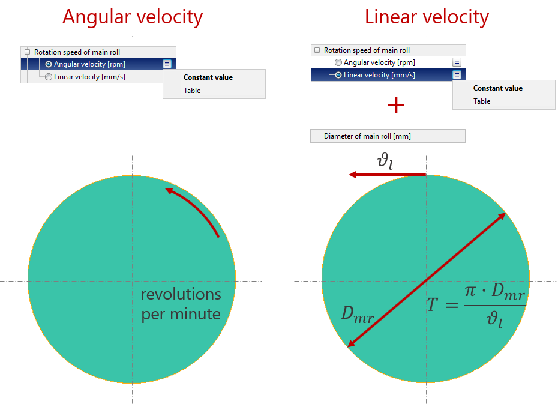

It is necessary to choose one of the variants of setting the rotational speed of the main roll: angular velocity or linear velocity.

For both variants possible to set constant value or table function depends on the outer diameter of the ring.

## Guide rolls

### Load on guide rolls

Load on guide rolls is specified in percent from _Maximum summary load of guide rolls_ \(Ring rolling mill database\). Load on guide rolls may be set constant or table function \(dependent on the current ring diameter\).

> Guide rolls have a great influence on the stability of the process and on the results of the simulation. So, if in a real process you have guide rolls use them in a simulation too.

### Deviation of guide rolls axis

To describe the deviation of the guide rolls from the central rolling line is used the right coordinate system \([right-hand rule](https://en.wikipedia.org/wiki/Right-hand_rule?oldformat=true)\).

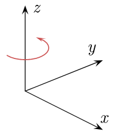

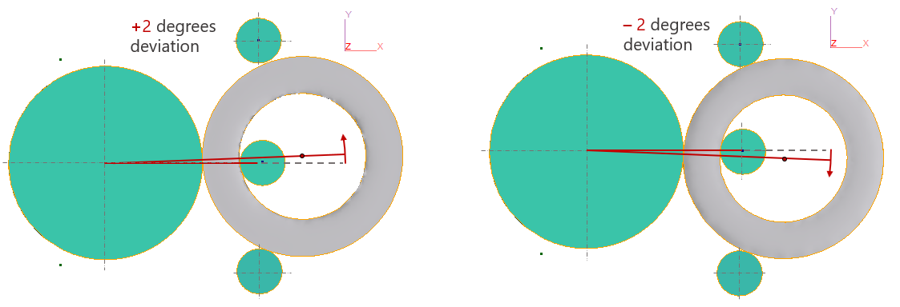

In practice, this feature is used together with [relative speed difference between main roll and axial rolls](advanced.md#main-roll-and-axial-rolls).

## Displacement of axial rolls

### Horizontal

There are a few variants of Horizontal motion settings:

* _**Automatically**_. The horizontal velocity of axial rolls is equal half of the ring grow speed.
* _**Table**_. The horizontal velocity of axial rolls is dependent on the current ring diameter.
* _**Starting from specified diameter**_. Axial rolls start to move when specified ring diameter is reached.  The velocity of axial rolls is equal to the ring grow speed.

### Vertical

* _**Movement only upper roll**_. Shifting only the upper axial roll.
* _**Upper/Lower symmetrical**_. Upper and lower rolls move towards each other or in opposite directions with the same velocity. 
* _**Upper/Lower in ratio**_. Upper and lower rolls are moved toward each other or opposite sides with the specified velocity ratio. 

## The motion of the mandrel and both cones

There are a few variants of setting the motion of the mandrel and axial rolls:

* **Ring rolling curve / Ring grow speed**
* **Velocity**
* **Mandrel velocity / Ring height**
* **Mandrel circular motion**

### Ring grow speed / Ring rolling curve

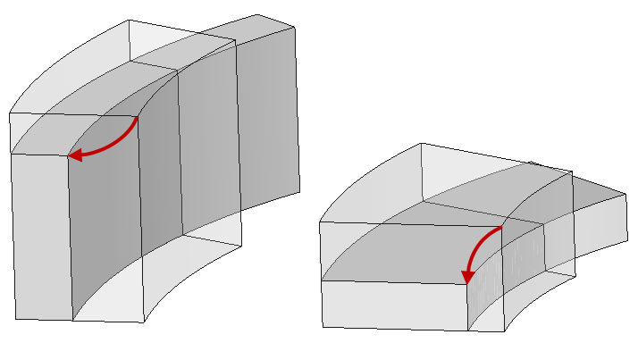

**Ring rolling curve** — the height of the ring depends on the thickness of the ring.

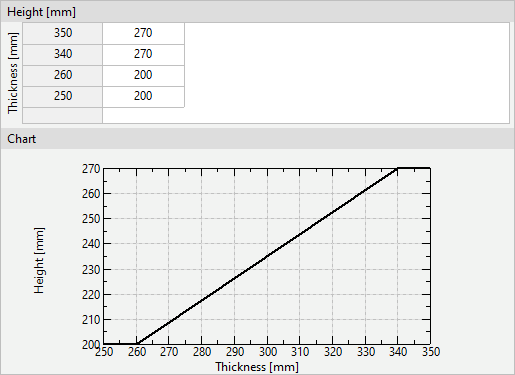

**Ring grow speed** — ring grow speed depends on the outer diameter of the ring.

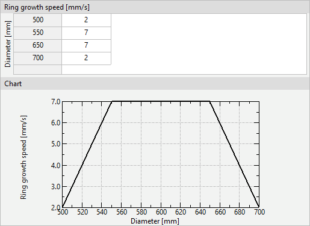

### Velocity

**Radial velocity** table — velocity of mandrel motion toward the main roll.

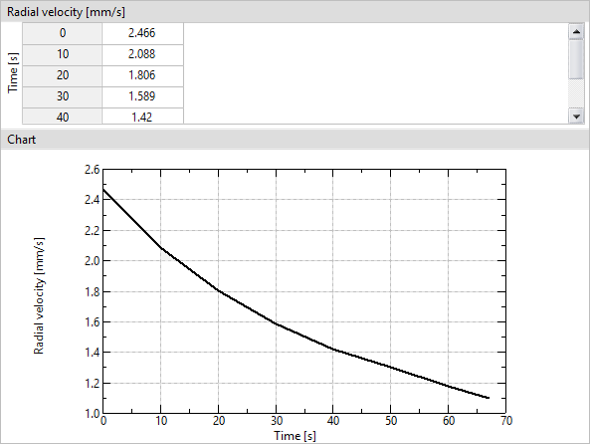

**Axial velocity** — velocity of reducing the axial gap \(the gap between axial rolls\).

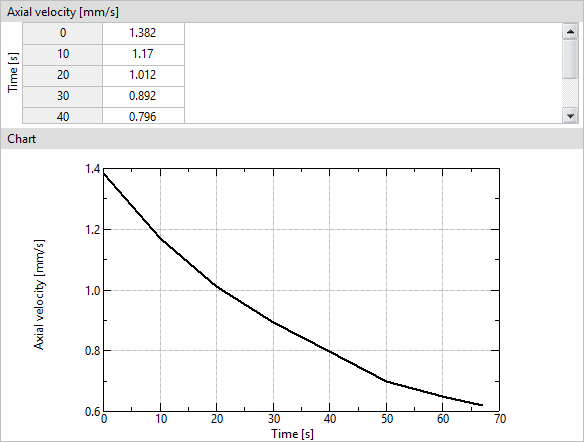

### Mandrel velocity/ring height

It is necessary to specify two tables:

**Radial velocity** — velocity of the mandrel depends on the outer diameter of the ring.

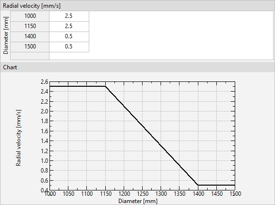

**Ring height** — the height of the ring depends on the outer diameter of the ring.

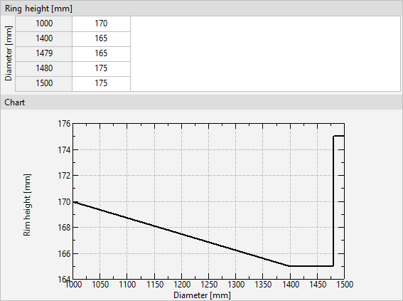

### Mandrel circular motion

You could see the explanation for this type of tools motion on the figure below.

Source: ASM Handbook Vol. 14 - Forming and Forging

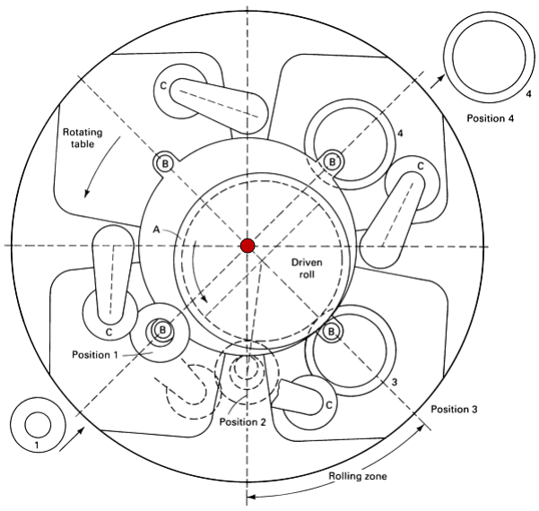

Schematic showing principle of operation of a four-station mechanical \(radial\) ring rolling mill. The ring blank is loaded at position 1. Rolling begins at position 2 and is completed at position 3. The finished ring is unloaded at position 4. A, driven roll; B, mandrels; C, guide rolls.

## Diameter of the main roll

It is necessary to specify the diameter of the main roll.

The diameter of the main roll is used:

* to find the rotational speed of the main roll by using _Linear velocity_
* to find the current thickness of the ring

> current thickness of ring is used to determine the velocity of the mandrel and axial roll \(if RRC and RGS are used\)

## Diameter of the mandrel

It is necessary to specify the diameter of the main roll.

The diameter of the main roll is used to find the current thickness of the ring.

