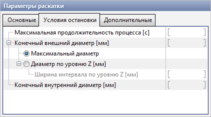

# Stop conditions

Simultaneously you may specify several conditions of the simulation stop. The calculation stops when at least one of the stop conditions is achieved.

> At least one stop condition should be specified.

## Maximum process duration

If a process time is reached a specified value, the calculation will stop.

## Finish outer diameter

### Maximum diameter

If a maximum diameter of the ring is reached a specified value, the calculation will stop. The maximum diameter of the ring is calculated automatically.

### Diameter at Z level

If a diameter of the ring on Z level is reached a specified value, the calculation will stop. QForm uses a coordinate system like in CAD system: Z coordinates in QForm the same as in the CAD system.

#### Width of Z-level interval \[mm\]

> For example : Z-level = 100mm, Z-level interval = 20mm. QForm will find the maximum diameter in Z-level range between 90mm and 110mm.

## Finish inner diameter

If a inner diameter of the ring is reached a specified value, the calculation will stop. To find the inner diameter of the ring it is necessary to know the outer diameter of the ring and thickness. That is mean that it is necessary to specify where to measure the

$$
D_{\text {inner}}=D_{\text {outer}} - 2 \text{Thickness}
$$

> An implicit reason of stopping the calculation can be the end of the ring rolling curve. When the mandrel and axial roll are reached the final point of RRC the calculation will stop.

