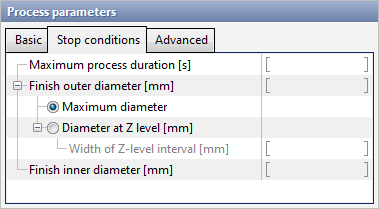
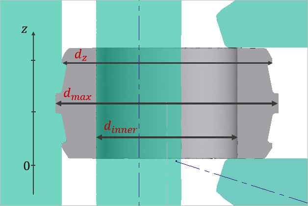

# 🛑 Условия остановки

Одновременно можно задать несколько условий остановки. Моделирование остановится, когда выполнится одно из условий остановки.


Как минимум одно условие остановки должно быть задано.


## Максимальная продолжительность процесса

Моделирование остановится, когда время процесса достигнет заданной величины.

## Конечный внешний диаметр

### Максимальный диаметр

Расчет остановится при достижении заданного максимального диаметра. Максимальный диаметр кольца вычисляется автоматически.

### Диаметр по уровню Z

Расчет остановится, когда диаметра кольца на заданном уровне Z достигнет заданной величины. QForm использует систему координат как в CAD системе: координаты Z в QForm такие же как и в CAD системе.

#### Ширина интервала по уровню Z \[мм\]

> Например: уровень Z = 100мм, ширина Z интервала = 20мм. QForm будет искать максимальный диаметр кольца в диапазоне Z координат от 90 до 110мм.

## Конечный внутренний диаметр

Расчет остановится при достижении заданного внешнего диаметра. Для нахождения внутреннего диаметра кольца необходимо знать внешний диаметр и толщину кольца. Это означает, что необходимо указать, где измерять внешний диаметр и при помощи заданий диаметра главного вала и оправки указать как будет измеряться толщина кольца.

$$
D_{\text {внутренний}}=D_{\text {внещний}} - 2 \text{Толщина}
$$


Неявным условие остановки может быть завершение кривой раскатки. Когда оправка и аксиальные валки достигнут конечной точки на кривой раскатки, то расчет остановится.


