# 💍 Rings rotation



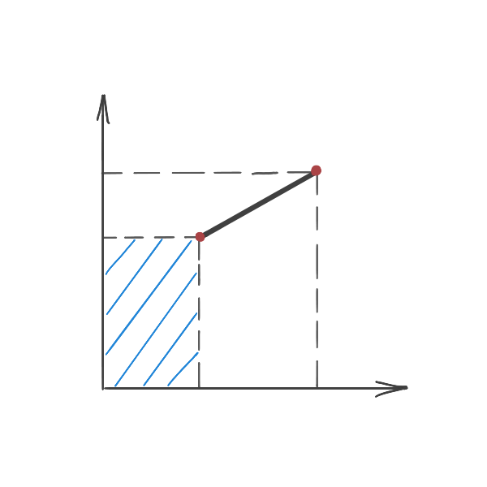



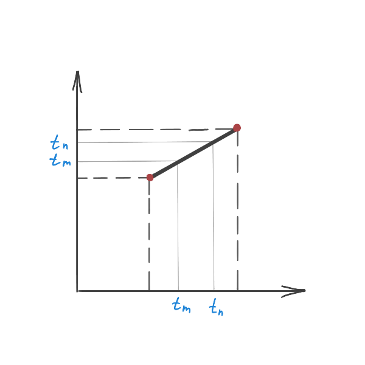



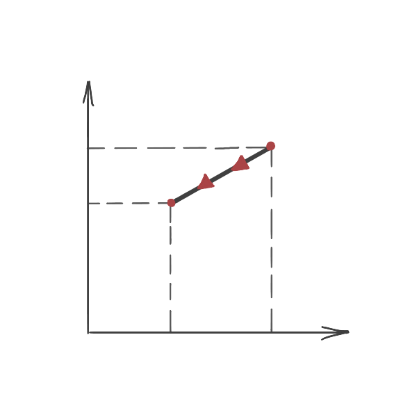



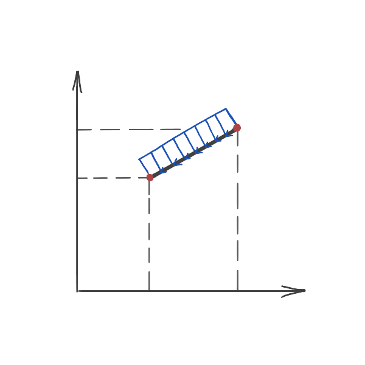



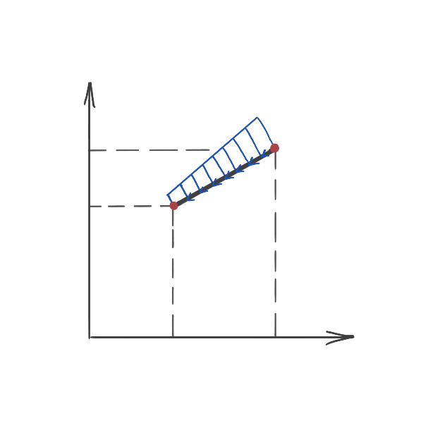



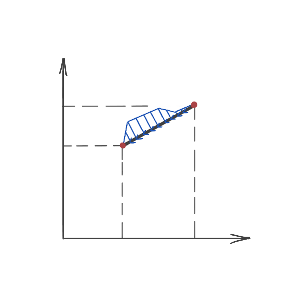



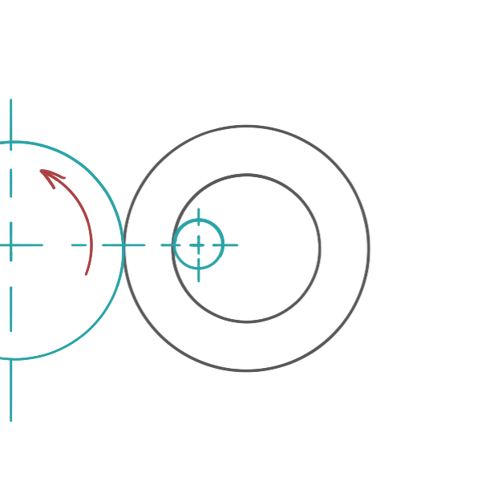



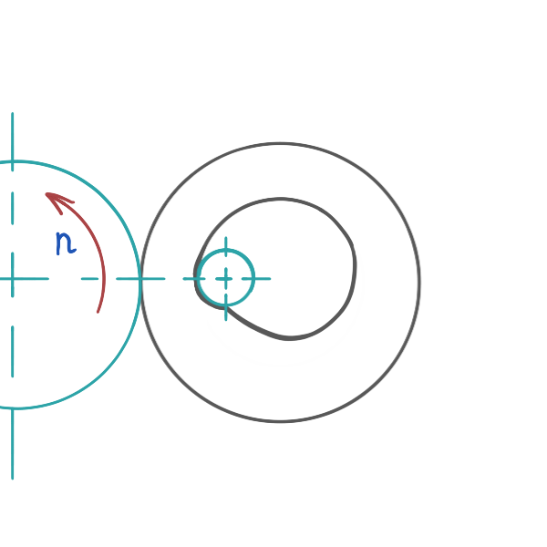



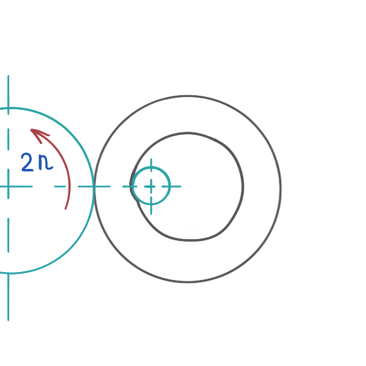



## Caltek \(South Korea\)

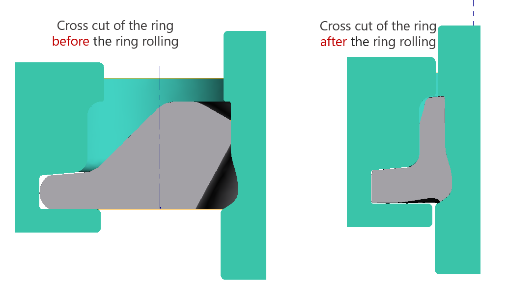

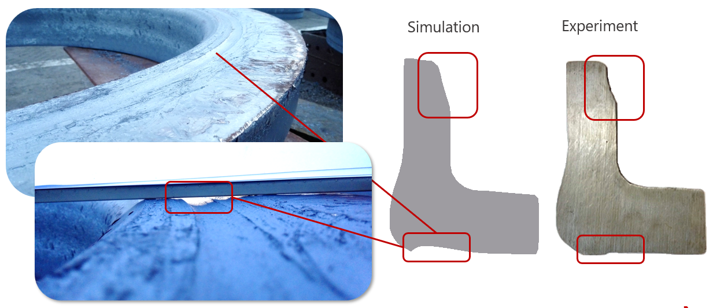

## Schmiedewerke Gröditz \(Germany\)

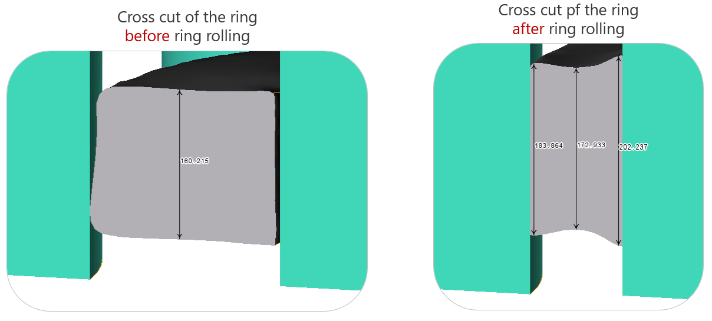

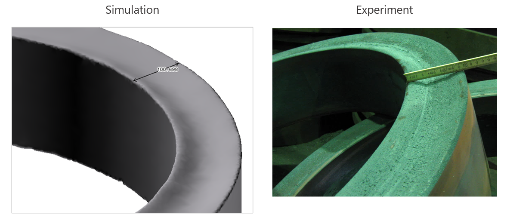

## Italy

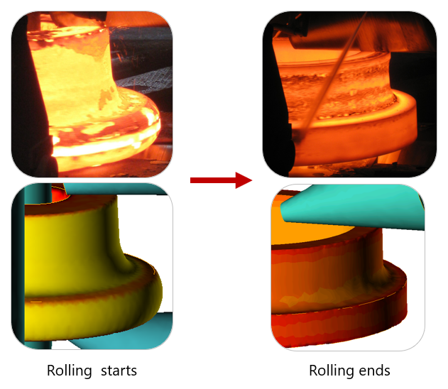

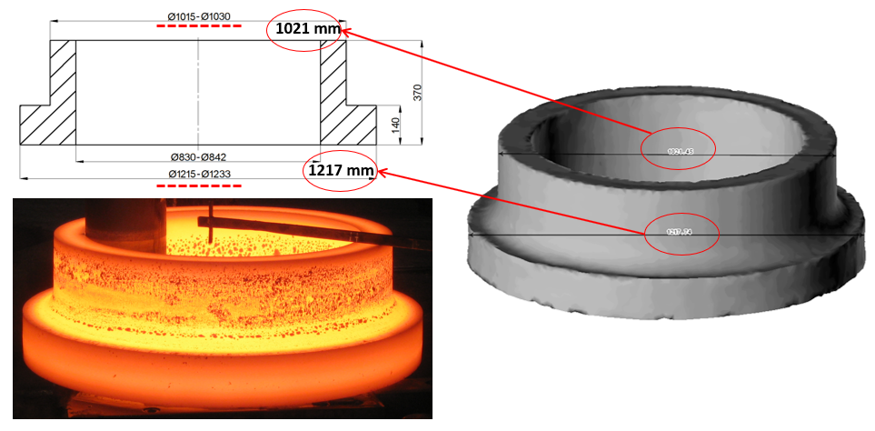

## Microstructure simulation

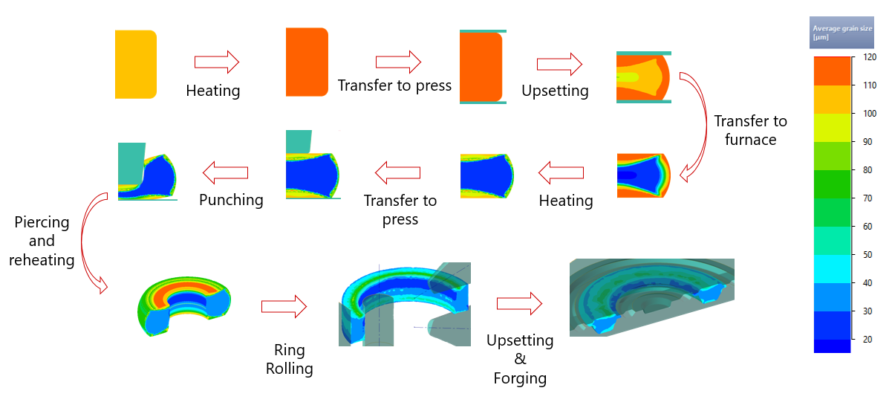

## Link to documentation

[https://danila-master.gitbook.io/documentation-ring-rolling/](https://danila-master.gitbook.io/documentation-ring-rolling/)

