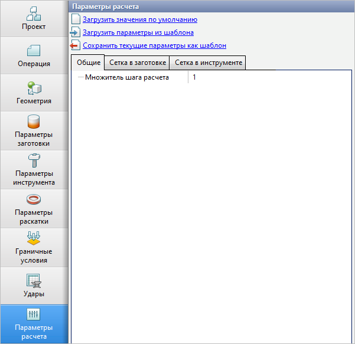

# General

_Simulation step multiplier_ — provides the possible proportional changing of the constant step of simulation that program select automatically. By default, the optimal value of the simulation step multiplier is specified equal to 1.

