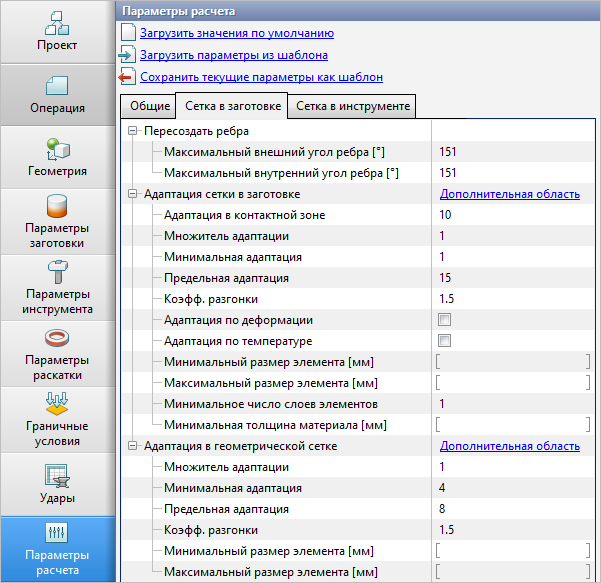

# Workpiece mesh

_Mesh adaptation in workpiece_ — control the adaptation of the computational mesh. The size of the elements of the computational mesh in the workpiece in the contact area with tool corresponds to dimension of the maximum element of the initial mesh that is divided by the specified value of the adaptation factor. By default the optimal value of the maximum adaptation factor \(_Adaptation in the contact zone_\) is specified equal to 10.

Influence of different parameters on the **computational mesh** \(read further about dual mesh method and computational mesh\).

By default:

  

\_\_

_Adaptation factor_ — 2 \(size of the mesh in the whole volume of the ring are smaller in 2 times than with default parameters\):

  

\_\_

_Adaptation in the contact zone_ — 15 \(size of the mesh in the contact zones are smaller in 2 times than with default parameters\):

  

Influence of different parameters on the **geometrical mesh** \(read further about dual mesh method and geometrical mesh\)

By default:

  

_Adaptation factor_ — 2_:_

 

_Minimum adaptation_ — 6_:_

 

