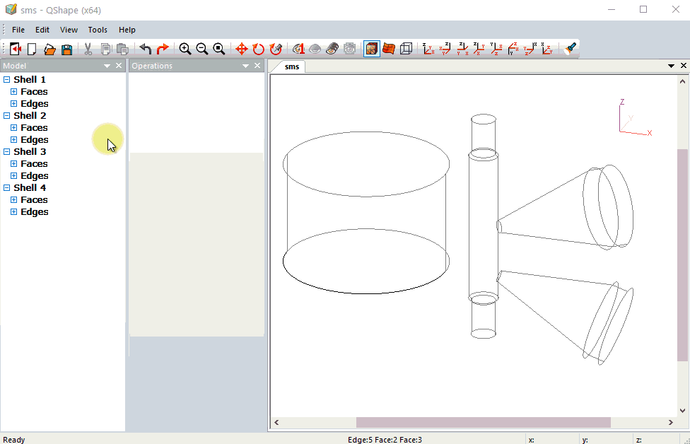

# Automatic axis setting

It is possible to set axis automatically in QShape. Geometry file should contain all objects for simulation. Use [STEP](https://en.wikipedia.org/wiki/ISO_10303-21?oldformat=true) format to load geometry in QShape.

1. Select a _Shell_ in _Model_ window
2. Press the button _Mesh generation_ in _Operations_ window
3. Select the cylindrical or conical surface on created _Solid_ object \(or other more difficult surface of rotation\) and press the button _Use face axis as Axis 1_
4. Convert _Solid_ object into tool from _Ring rolling object_ list

> this option will be added in QForm interface in the next version

